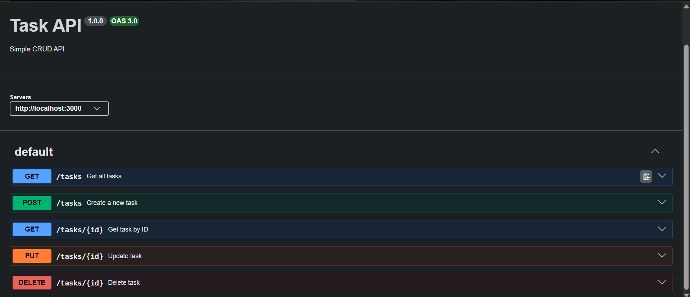

# Task API

A simple RESTful CRUD API built with **Node.js** and **Express.js** as part of the FlyRank Backend Week 2 Assignment.

The API allows users to create, read, update, and delete tasks using an in-memory data store. It also includes interactive API documentation using **Swagger UI**.

---

## Features

- Create a new task
- Get all tasks
- Get a task by ID
- Update an existing task
- Delete a task
- Health check endpoint
- Interactive Swagger UI documentation

---

## Tech Stack

- Node.js
- Express.js
- Swagger UI Express
- OpenAPI 3.0

---

## Project Structure

```
task-api/
│
├── index.js
├── openapi.json
├── package.json
├── package-lock.json
├── .gitignore
├── README.md
└── screenshots/
    └── swagger-ui.png
```

---

## Installation

Clone the repository:

```bash
git clone https://github.com/ZeenatFatima811/flyrank-crud-api-task2.git
```

Go to the project directory:

```bash
cd task-api
```

Install dependencies:

```bash
npm install
```

Start the server:

```bash
node index.js
```

The server will start at:

```
http://localhost:3000
```

---

## API Endpoints

| Method | Endpoint | Description |
|---------|----------|-------------|
| GET | `/` | API information |
| GET | `/health` | Health check |
| GET | `/tasks` | Get all tasks |
| GET | `/tasks/:id` | Get a task by ID |
| POST | `/tasks` | Create a new task |
| PUT | `/tasks/:id` | Update a task |
| DELETE | `/tasks/:id` | Delete a task |

---

## Sample Request

### Create a Task

**POST** `/tasks`

Request Body

```json
{
  "title": "Learn Express"
}
```

Response

```json
{
  "id": 4,
  "title": "Learn Express",
  "done": false
}
```

---

## Swagger Documentation

After starting the server, open:

```
http://localhost:3000/docs
```

Swagger UI provides interactive documentation for all available endpoints and allows testing the API directly from the browser using the **Try it out** feature.

## Swagger UI Screenshot



---

## HTTP Status Codes

| Status Code | Description |
|-------------|-------------|
| 200 | OK |
| 201 | Created |
| 204 | No Content |
| 400 | Bad Request |
| 404 | Not Found |

---

## Notes

- This project uses an **in-memory array** to store tasks.
- Data will reset whenever the server restarts.
- No external database is used.

---

## Author

**Zeenat Fatima**

BS Computer Science Student

University of Education, Lahore